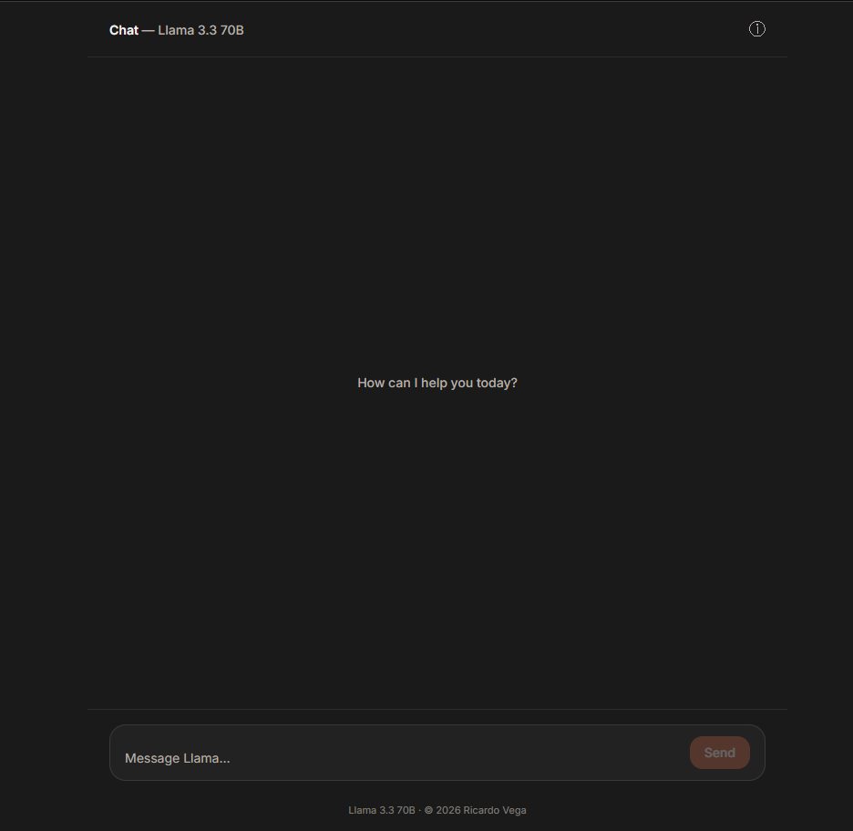
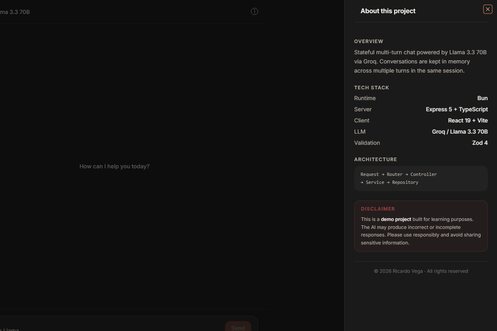

# Llama Chat Bot — AI Chat

A full-stack, multi-turn AI chat application built as a **Bun monorepo**. The server exposes a stateful REST API powered by **Groq** (Llama 3.3 70B), and the client is a dark-themed React 19 UI with session persistence via `localStorage`.

---



---

## Overview

| | Client | Server |
|---|---|---|
| Runtime | Bun | Bun |
| Framework | React 19 + Vite | Express 5 |
| Language | TypeScript 5 (strict) | TypeScript 5 (strict) |
| Styling | Tailwind CSS v4 + shadcn/ui | — |
| LLM | via REST API | Groq SDK — Llama 3.3 70B |
| Validation | Zod 4 | Zod 4 |
| Rate Limiting | `useRateLimit` hook (UX guard) | express-rate-limit (enforced) |
| Testing | Vitest + Testing Library | Bun Test |

---

## Monorepo Structure

```txt
chat-bot/
├── packages/
│   ├── client/          # React 19 chat UI
│   └── server/          # Express REST API
├── .gitignore
├── .prettierignore
├── bun.lock
├── index.ts
├── package.json
├── tsconfig.json
└── README.md            ← you are here
```

Each package is self-contained with its own `package.json`, `tsconfig`, `.env`, and test suite:

- [`packages/client/README.md`](./packages/client/README.md)
- [`packages/server/README.md`](./packages/server/README.md)

---

## Architecture

```txt
Browser (React UI)
       ↓  POST /api/chat
Express Server (Controller → Service → Repository)
       ↓
   Groq API (Llama 3.3 70B)
```

The client generates a `conversationId` with `crypto.randomUUID()` on first load and persists it in `localStorage`. Every message sent to the server includes this ID, which the server uses to look up the full conversation history from its in-memory store — giving the LLM full multi-turn context.

---



---

## Getting Started

### Prerequisites

- [Bun](https://bun.sh) >= 1.0
- A [Groq API key](https://console.groq.com)

### Install all dependencies

From the monorepo root:

```bash
bun install
```

### Environment Variables

**Server** — create `packages/server/.env`:

```env
GROQ_API_KEY=your_api_key_here
PORT=3000
```

**Client** — create `packages/client/.env`:

```env
VITE_API_URL=http://localhost:3000
```

### Run both packages

```bash
# Start the API server
cd packages/server && bun dev

# In a separate terminal, start the client
cd packages/client && bun run dev
```

Then open http://localhost:5173 in your browser.

---

## API Reference

### `POST /api/chat`

Send a message and receive a response from the LLM. Pass the same `conversationId` on every request to maintain conversation context.

| Field | Type | Rules |
|---|---|---|
| `prompt` | `string` | Required, 1–1000 characters |
| `conversationId` | `string` | Required, valid UUID v4 |

**Success `200 OK`**

```json
{
  "message": "The capital of France is Paris.",
  "conversationId": "123e4567-e89b-12d3-a456-426614174000"
}
```

**Error responses**

| Status | Cause |
|---|---|
| `400` | Validation failed (missing field, bad UUID, prompt too long) |
| `429` | Rate limit exceeded (100 requests / 15 min per IP) |
| `500` | Unexpected server or Groq API error |

---

## Features

### Client

- Dark theme inspired by Claude, built with shadcn/ui CSS variable tokens
- Multi-turn conversations with full context preserved across messages
- Session persistence — `conversationId` survives page refreshes
- Input validation with Zod 4 (sanitization + min/max length)
- Client-side rate limiting via `useRateLimit` (prevents accidental spam and improves UX)
- Keyboard support — `Enter` to send, `Shift+Enter` for new line
- Auto-scroll to latest message
- Responsive layout with mobile support
- About panel with project info and disclaimer
- Offline font — Inter Variable loaded locally (no CDN dependency)

### Server

- Stateful in-memory conversation store per `conversationId`
- Strict Zod validation on all incoming requests
- Rate limiting — 100 requests per 15 minutes per IP
- Lazy Groq client initialization for easy test mocking
- Structured 3-layer architecture: Controller → Service → Repository

---

## Testing

Both packages have tests and no real network calls are required.

```bash
# Client tests (Vitest)
cd packages/client && bun run test

# Server tests (Bun Test)
cd packages/server && bun test
```

---

## Design Decisions

**Validation on both sides** — client-side Zod gives instant feedback and prevents unnecessary requests, while server-side Zod is the real security boundary.

**Rate limiting on both sides** — the client `useRateLimit` is a UX guard (no security guarantees), while `express-rate-limit` on the server is the actual enforcement.

**In-memory conversation store** — simple and dependency-free for a demo project. A production version would replace it with Redis/DB without changing the service API.

**Token-based dark theme** — all client colors reference shadcn/ui CSS variables; switching themes only requires updating tokens in `index.css`.

---

## Disclaimer

This is a **demo project** built for learning purposes. The AI may produce incorrect or incomplete responses. Please use responsibly and avoid sharing sensitive information.

---

## License

Educational Use Only

© 2026 Ricardo Vega. All rights reserved.  
This project is provided strictly for educational and non-commercial purposes.
